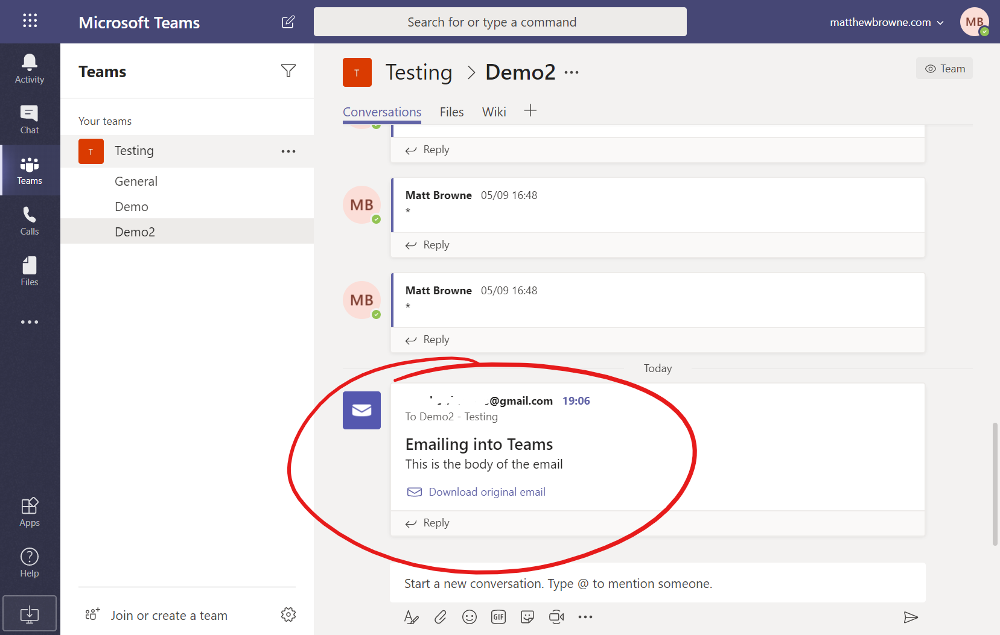
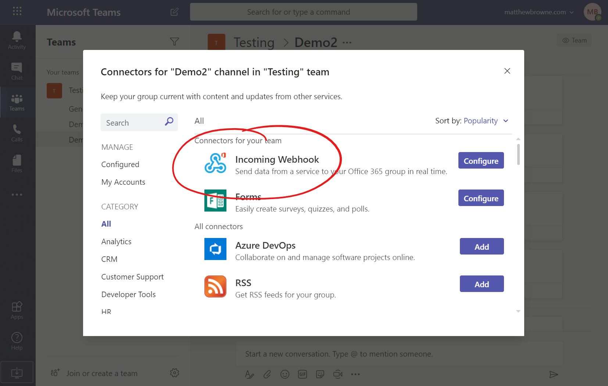
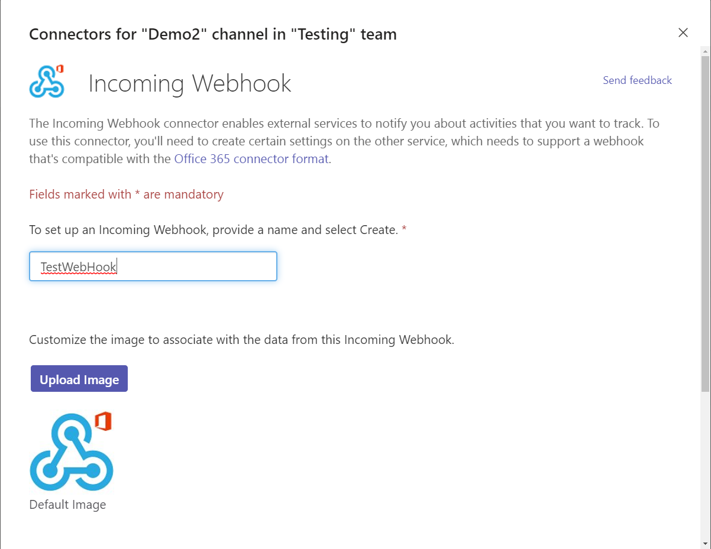
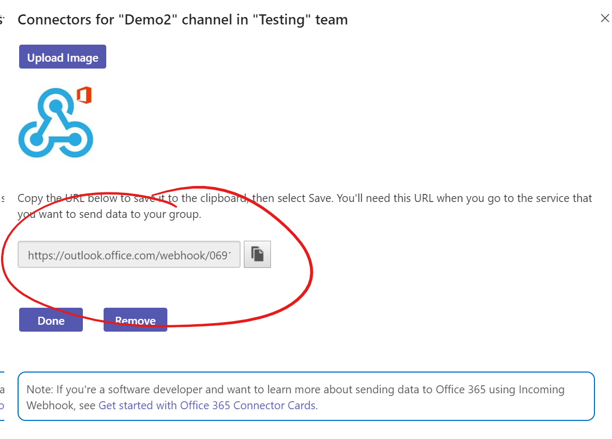
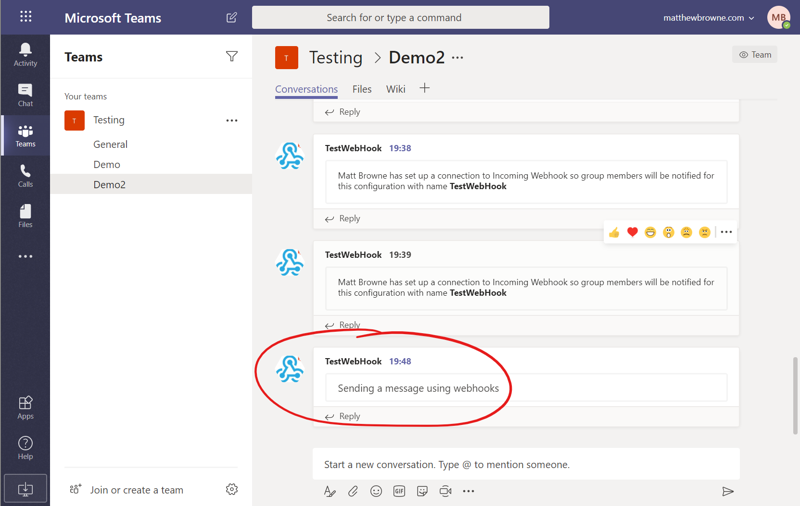

+++
author = "@MattBrowne"
categories = [""]
date = "2019-11-20"
description = ""
featured = "pipes.jpeg"
featuredalt = ""
featuredpath = "date"
linktitle = ""
title = "How to Send Messages to Microsoft Teams with PowerShell"
tags = ["Teams", "PowerShell"]
type = "post"
draft = "true"
+++

Teams is getting more and more popular in many business.  It's great for many purposes, and it's great for piping alerts and notification into.  Rather then having a mass of notifications going into you mailbox, you can manage and view them in Teams.  In this post we are going to look at the various ways to pipe messages to Microsoft Teams with PowerShell

# Email a Simple Message to Teams

Emailing into Teams channels is one of the simplest methods.  Each channel has an email address.  You can find this by going to the three dots against the channel name and selecting "Get email address" in the dropdown.


We can use the "Send-MailMessage" cmdlet to send a test message to the channel.  Just use the email address you have and add a subject/body.  You will need to supply an SMTP.  This can be a internal replay or a service like SendGrid etc.  It's possble to use O365 as the SMTP address but thats for another post.

```PowerShell
Send-MailMessage -To "Demo2 - Testing <8f5c8f4e.matthewbrowne.com@uk.teams.ms>" -Subject "Emailing to Teams" -Body "This is the body of the email" -SmtpServer smtp.corp.com
```
It takes a few seconds to arrive, but this is what the message looks like when it hits the Teams channel.



Now you can use this for any of your scripts that can email the output.  Just pipe the output rom your script into the subject and body.  The formatting on the message on Teams can be a little limiting with longer emails.  If they get too long it will truncate them and make you click onthe original message to get the information.

Often this method is good enough to get info into Teams and out of the Inbox.  If the subject of the email is informative enough then your probably good.

# Sending Messages with Webhooks

To configure a webhook for you Teams channel, go to the three dots against the team again.  Click on "Connectors".  Then look for "Incoming Webhook" in the list if connectors, and click "Configure".



Give you webhook a simple name, and upload a logo image if you like.  Scroll down and click "Create"



You will now see the webhook address appear.  Copy this and save it for later.  This is what we are going use to send the message.




Now that we have our webhook URL for the Teams channel, we can start putting the code together.  First off, we need to put the URL into a variable.

```PowerShell
$webhookUri = "https://outlook.office.com/webhook/06918913-abc7-452c-81ff-25177c2feebf@5e79c439-6e7f-4b3f-b99a-9c1dc4ca414a/IncomingWebhook/028c7710c46d4d78844c7d7ee249d18e/2b256853-85e8-4911-a5e6-4c663998d73c"
```
Next we need to build the message to send.  Teams expects a JSON object with some text.  To do this we need to build a simple hashtable and convert it to JSON.

```PowerShell
$body = @{text = 'Sending a message using webhooks'} | ConvertTo-Json
```
Now we just need to send the message.  We have the webhook URI and the body, so we can use "Invoke-RestMethod" to send it.  We just need to make sure the content type is JSON

```PowerShell
Invoke-RestMethod -uri $webhookUri -Method Post -body $body -ContentType 'application/json'
```

We can put all this together and run it to send the message.  This is the nice clean message we get in Teams.




## Sub-Section 1

[I'm an inline-style link with title - Markdown cheatsheet](https://github.com/adam-p/markdown-here/wiki/Markdown-Cheatsheet "Google's Homepage")


```PowerShell
#A PowerSHell code block
Get-Service
Get-AzureRMVM
```

# Link to the 