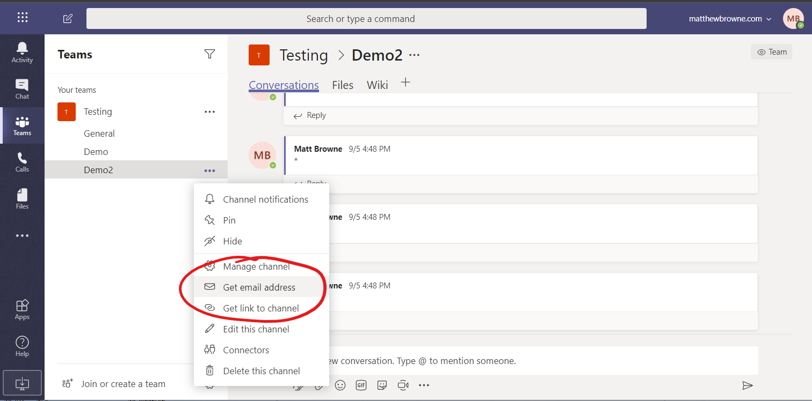

+++
author = "@MattBrowne"
categories = [""]
date = ""
description = ""
featured = "pipes.jpeg"
featuredalt = ""
featuredpath = "date"
linktitle = ""
title = "How to Send Messages to Microsoft Teams with PowerShell"
tags = ["Teams", "PowerShell"]
type = "post"
draft = "true"
+++

Teams is getting more and more popular in many business.  It's great for many purposes, and it's great for piping alerts and notification into.  Rather then having a mass of notifications going into you mailbox, you can manage and view them in Teams.  In this post we are going to look at the various ways to pipe messages to Microsoft Teams with PowerShell

# Email a Simple Message to Teams

Emailing into Teams channels is one of the simplest methods.  Each channel has an email address.  You can find this by going to the three drots against the channel name and selecting "Get email address" in the dropdown.




## Sub-Section 1

[I'm an inline-style link with title - Markdown cheatsheet](https://github.com/adam-p/markdown-here/wiki/Markdown-Cheatsheet "Google's Homepage")


```PowerShell
#A PowerSHell code block
Get-Service
Get-AzureRMVM
```

# Link to the 